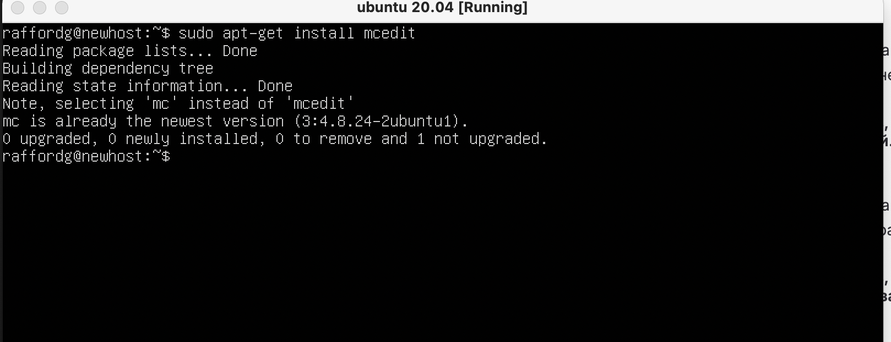
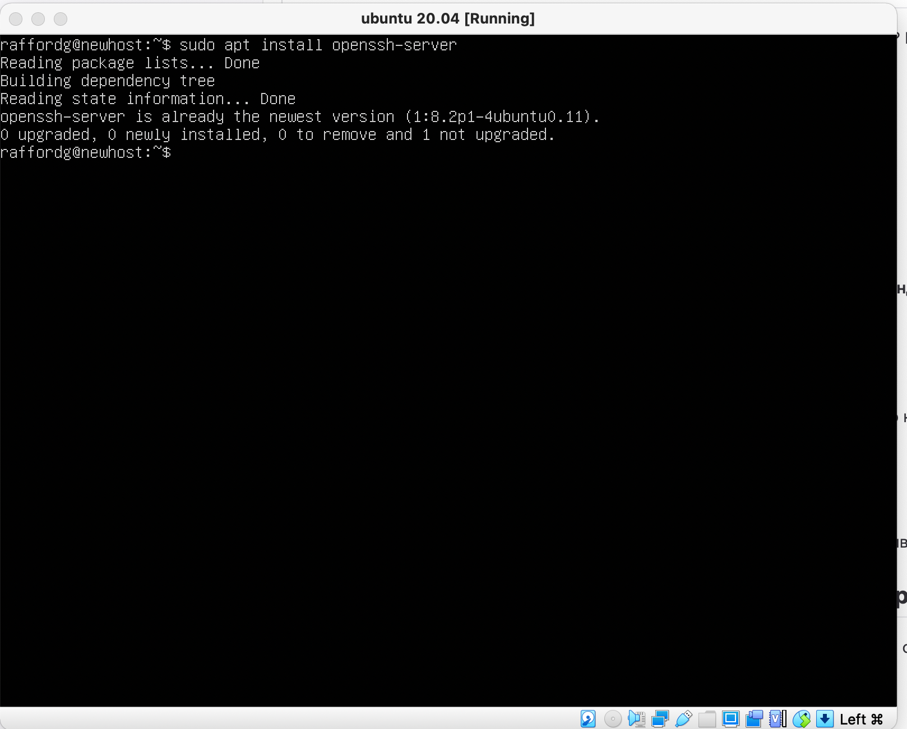
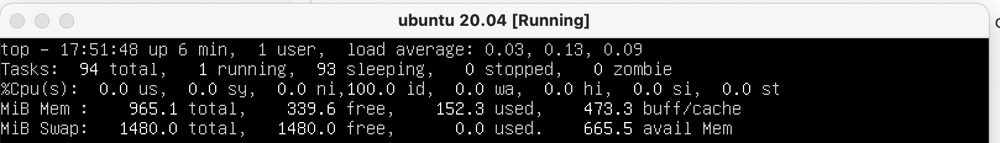

# Linux D01 report by ananar27

## Part 1. Installation of the OS

  *OS installed*

- Ubuntu version checked via `cat /etc/issue` command.

## Part 2. Creating a user

- Add new user via `sudo useradd (name)` command.

  *new user*

- Add new user to `adm` group via `sudo usermod -a -G adm (name)`

  *new user added to adm group*

- Check if user is present via `cat /etc/passwd`

  *new user present*

## Part 3. Setting up the OS network

- Machine name can be set via `hostnamectl set-hostname 'new-hostname'` command, where 'new-hostname' is the desired name.
- Another option is to change `/etc/hostname` file.

  *new hostname*

- Timezone can be changed via `sudo timedatectl set-timezone Europe/Moscow` command, where `Europe/Moscow` can be changed to desired timezone.

  *new timezone*

- Output the names of the network interfaces can be obtained via looking to catalog */sys/class/net* or by using command `ip -br a show`.
- The `lo` or 'loopback device' is a special, virtual network interface that computer uses to communicate with itself. It is used mainly for diagnostics and troubleshooting, and to connect to servers running on the local machine.

  *new network interfaces*

- To get the ip address of the device we are working on from the DHCP server, we need to use `sudo dhclient -v enpOs3`, where `enpOs3` was discovered earlier.

- DHCP - Dynamic Host Configuration Protocol.ip route | grep default

  *DHCP*

- Return your external IP via `curl ifconfig.me`.
- You can also use `wget -qO- eth0.me`.

  *external IP*

- Get information about default IP with `ip route | grep default`.

  *default IP*

- To change  ip, gw, dns settings we need to change file */etc/netplan/00-installer-config.yaml*. Set `dhcp4` to `false`. Add addresses.

  *new network settings*

- Reboot with `sudo reboot` and then ping 1.1.1.1 and ya.ru remote hosts. Look on the 0% packet loss.

  *ping results*

## Part 4. OS Update

- Update the OS via `sudo apt-get update` command.

- Then use `sudo apt-get upgrade` command. Confirm changing the disk space.

  *update*

## Part 5. Using the sudo command

- command `sudo` stands for "Substitute User and do". It enables users to run programs with the security privileges of another user, by default the superuser.

- Change password for `useruser` user.

  *password change*

- Give sudo rights to `useruser` user by using `sudo usermod -a -G sudo useruser`

  *sudo rights*

- Change the user via `su useruser` and use `sudo hostnamectl set-hostname newhost`

  *change user*

## Part 6. Installing and configuring the time service

- Output the current time.

  *current time*

- Install ntp for time sync with `sudo apt-get install ntpdate`.

  *ntp installed*

- Output the current time once again.

  *current time again*

## Part 7. Installing and using text editors

- Installation of VIM, NANO, MCEDIT.

  *VIM, NANO, MCEDIT*

  *VIM, NANO, MCEDIT*

  *VIM, NANO, MCEDIT*

- Screenshot of VIM. To exit with save you need to quit insert mode by pressing `ESC`, then you need to type `:wq`.

  *VIM redacted*

- Screenshot of NANO. To exit with save you need to press `CTRL+X`, then press `Y` to confirm.

  *NANO redacted*

- Screenshot of MCEDIT. To exit with save you need to press `F2`, confirm with `Enter`, press `F10`.

  *MCEDIT redacted*

- Screenshot of VIM with edited content. To quit without saving press `ESC` and then type `:q!`.

  *VIM redacted*

- Screenshot of NANO with edited content. To quit without saving you need to press `CTRL+X`, then press `n` to confirm.

  *NANO redacted*

- Screenshot of MCEDIT. To exit without save you need to press `F10` and `n` to confirm.

  *MCEDIT redacted*

- VIM can search and replace with a single command `:s/<search_term>/<replace_term>`

  *VIM rserach/replace*

- For NANO you need to press `CTRL`+`\`. Type search string, press `ENTER`. Then type substitute string, press `ENTER` again. Press `a` to change all occurances.

  *NANO rserach/replace*

- For MCEDIT you need to press `F4`, type search word, press `TAB`, type substitute word, press `ENTER` and then press `ENTER` again.

  *MCEDIT rserach/replace*

## Part 8. Installing and basic setup of the SSHD service

- Install OpenSSH-server via `sudo apt install openssh-server`.

  *OpenSSH-server installed*

- Start SSH automatically on boot by using `sudo systemctl enable ssh`.
  *OpenSSH-server started*

- To reset to port 2022 we nned to edit file */etc/ssh/sshd_config*: uncomment port 22 in file and change 22 to 2022.

  *OpenSSH-server started*

- Use `ps` command to see ssh process. We need to use `-C` to print only the process IDs of SSHd.

  *openssh-server ps*

- Rebbot system via `sudo reboot`. Install netstat via `sudo apt install net-tools`. Call `netstat -tan` and examine if `tcp 0 0.0.0.0:2022 0.0.0.0:* LISTEN` is present.

  *install nettools*
  *OpenSSH-server netstat*

- Netstat is a command line utility that can be used to list out all the network (socket) connections on a system.

- Key `-a`: (all) Displays all options, not displays listen associated by default

- Key `-t` (tcp) only shows TCP-related options

- Key `-n` refuses to display an alias, which can display all of the numbers into numbers.

- Column `Proto`: the protocol (tcp, udp, raw) used by the socket.

- Column `Recv-Q`: the count of bytes not copied by the user program connected to this socket.

- Column `Send-Q`: the count of bytes not acknowledged by the remote host.

- Column `Local Address`: address and port number of the local end of the socket.

- Column `Foreign Address`: address and port number of the remote end of the socket.

- Column `State`: the state of the socket.

- 0.0.0.0 can be used as own source address in IP.

## Part 9. Installing and using the top, htop utilities

- Install top and htop utilities. They were already installed on my system.

  *top and htop installed*

- top utility output. You can see needed values at the picture below.

  *top output*

1. Uptime: 14 min 05 sec;

2. Number of authorised users: 1;

3. Total system load: 0.13%;

4. Total number of processes: 94;

5. Cpu load: 100.0 (id)

6. Memory load: 153.3 used, 473.3 cache.

7. Pid of the process with the highest memory usage: 642 (use `SHIFT`+`M`)

8. Pid of the process taking the most CPU time: 2013

- To sort in htop, you need to press `F6` and choose process.

  *htop output*

  *htop output*

  *htop output*

  *htop output*

- filtered for SSHd process. Press `F4` and type needed process.

  *htop output*

- htop with the syslog process. You need to press `F3` and type needed process.

  *htop output*

- To add output, enter setup mode by pressing `F2`, choose and add needed outputs to right column.

  *htop output*
  *htop output*
  *htop output*
  *htop output*
  *htop output*
  *htop output*

## Part 10. Using the fdisk utility

- Run `fdisk -l` command.

  *fdisk output*

- name: /dev/sda;
- disk size: 10GiB;
- sector quantity : 20971520;
- swap size : 0.

## Part 11. Using the df utility

- Run `df` command

  *df output*

- Partition size: 8408452.
- Space used: 4141876.
- Space free: 3817860.
- Percentage used: 53.
- Measurement unit: kylobytes.

  *df -Th output*

- Partition size: 8.1G.
- Space used: 4.0G.
- Space free: 3.7G.
- Percentage used: 53.
- Filesystem: `ext4`.

## Part 12. Using the du utility

- Output the size of /home, /var, /var/log folders. Use `du -lhs`+name command.

  *du output*

- Output the size of all contents in /var/log.

  *du output*

## Part 13. Installing and using the ncdu utility

- Install ncdu via `sudo apt install ncdu`.

  *ncdu installed*
  *ncdu installed*
  *ncdu installed*

## Part 14. Working with system logs

- Open */var/log/dmesg* via `cat /var/log/dmesg`

  *cat /var/log/dmesg*

- Open */var/log/syslog* via `cat /var/log/syslog`

  *cat /var/log/syslog*

- Open */var/log/auth.log* via `cat /var/log/auth.log`

  *cat /var/log/auth.log*

- Check login via `lastlog`. Here my user is specified via `lastlog -u vova`.

  *lastlog output*

- Restart SSHd via `sudo systemctl restart sshd`. Find last rows in */var/log/syslog*

  *cat /var/log/syslog*

## Part 15 Using the CRON job scheduler

- To run `uptime` via CRON you need to type `crontab -e` and add `*/2 * * * * uptime` at the end.

  *crontab -e*

- Current tasks can be checked via `crontab -l`.

  *crontab -l*
